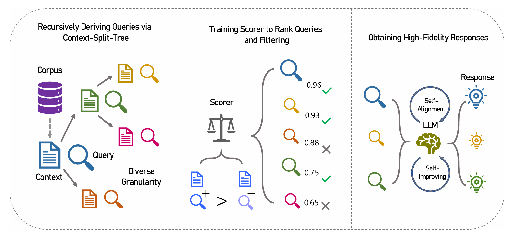
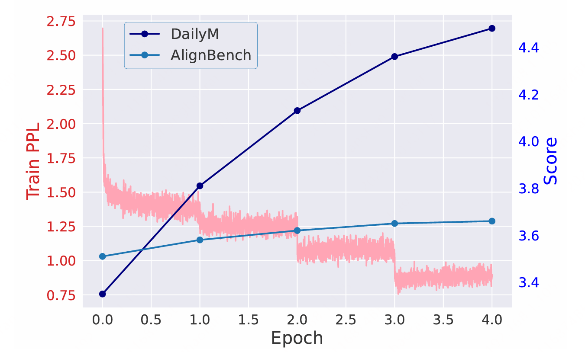

# Automatically Generating Numerous Context-Driven SFT Data for LLMs across Diverse Granularity



<div align="center">


[](https://arxiv.org/abs/2405.16579)
[](https://huggingface.co/collections/quanshr/augcon-66801252752d68b77f73ee02)
[](#Corpus)
[](#sft-data)
[](#fine-tuned-model)

</div>

This is the official repository for the implementation of AugCon, which is capable of automatically generating context-driven SFT data across multiple levels of granularity with high diversity, quality, and fidelity. 
AugCon begins by generating queries using the Context-Split-Tree (CST), an innovative approach for recursively deriving queries and splitting context to cover full granularity. Then, we train a scorer through contrastive learning to collaborate with CST to rank and refine queries. Finally, a synergistic integration of self-alignment and self-improving is introduced to obtain high-fidelity responses.

## 🔧 Requirements

- python 3.9 and above
- deepspeed 0.13.4 and above
- vllm 0.4.0 and above
- CUDA 11.8 and above are recommended

We recommend you run AugCon using a virtual conda environment:

```bash
conda create -n augcon-env python=3.11.7
conda activate augcon-env
conda install cudatoolkit=12.1
pip install -r requirements.txt
```

## 💡 Generating

The first step is to generate queries using CST and start the LLM API service using the vllm engine. This step recursively split the context and derive a question for the granularity of the context until the context length is less than the minimum threshold.

This is the command running on 8 GPUs. If using a different number of GPUs, the `-- tensor-parallel-size` parameter below needs to be changed accordingly, requiring at least two GPUs.

```bash
nohup python -m vllm.entrypoints.openai.api_server \
     --model Qwen/Qwen1.5-32B-Chat \
     --tensor-parallel-size 8 > vllm.log 2>&1 &
sleep 3m # wait for the server to start
python step1_gen_q.py
pkill -9 -e -f vllm
```

The second step is to train the scorer and filter the queries, in order to filter out some duplicate queries and retain relatively high-quality ones.

```bash
deepspeed step2_scorer.py
```

Step three, open the vllm service engine again and get the answer to the queries. 

```bash
nohup python -m vllm.entrypoints.openai.api_server \
     --model Qwen/Qwen1.5-32B-Chat \
     --tensor-parallel-size 8 > vllm.log 2>&1 &
sleep 3m
python step3_gen_a.py
pkill -9 -e -f vllm
```

Alternatively, we provide a script to run all steps with one click.

```bash
bash augcon.sh
```

## ⭐ Fine-tuning

After obtaining SFT data, we can perform fine-tuning using any fine-tuning method. In this repository, we use the generated SFT data to train the model using QLoRA to obtain the checkpoints in `results/ckpts` and the LoRA parameters in `results/LoRA`, and then merge the LoRA parameters to obtain fine-tuned model in `results/sft_model`.


```bash
deepspeed finetune.py
python merge.py
```

<details><summary>Train Loss</summary>



The overall satisfaction scores increase steadily in both the `DailyM` test set and `AlignBench` during the training process. An interesting observation is that the training loss appears to plateau within epochs from Epoch 2 onwards, yet we observe sudden drops in loss at the boundaries between twoconsecutive epochs. This pattern strongly signals that our training dataset is characterized by extremely low similarity and exceptionally high diversity, meaning that training on one segment of data does not have an impact on the loss associated with another segment. 

</details>

Then, you can use the following command to infer and generate the responses to the queries in the `DailyM` test set. For some old versions, you may need to manually copy the tokenizer files from the base model to `results/sft_model` first.

```bash
nohup python -m vllm.entrypoints.openai.api_server \
     --model results/sft_model \
     --tensor-parallel-size 8 > vllm.log 2>&1 &
sleep 3m
python inference.py
pkill -9 -e -f vllm
```

## 📖 Input

> [!NOTE]
> The corpus can be replaced with any other corpus to generate customized SFT data, and the base model and related configurations can also be customized and modified.

### Corpus

What we need to provide is a custom corpus, which contains text content in the format of Huggingface `Dataset`. The `article` field is the text content, and we will construct the corresponding question and answer SFT data based on this corpus. In this repository, it is the `DailyM` file.

The `DailyM` corpus consists of 1,000 articles carefully selected from a variety of high-quality Chinese magazines closely related to daily life. These articles extensively cover issues of widespread public concern such as basic livelihood, politics, economics, and law, with each article containing approximately 4,000 Chinese characters.

### Few-shot Examples & Configurations

We need to provide a few (around 5-10) question-answer pairs as the few-shot examples, indicating how we want to derive SFT data. In this repository, they are in `qa_examples.jsonl`.

The base model used in this repository is `Qwen/Qwen1.5-32B-Chat`, but all code is compatible with other open source models, such as Llama2, Llama3, etc.

There are some related parameters in `config.py` that can be modified as needed.

## 📖 Output

### SFT Data

After we finish appling the three essential steps on our custom corpus, we will obtain the `sft_data` file (in `Dataset` format, containing the two fields question and answer) in the generated `results` folder, which is the generated SFT data. In this repository, we get the `DailyM-SFT` as the SFT data derived from the `DailyM` corpus.

### Fine-tuned Model

Finally, we use all generated SFT data to fine-tune the model and get the fine-tuned model. In this repository, we only provide the LoRA parameters in `Qwen-DailyM-32B-LoRA` to reduce the memory, and you can run `merge.py` to merge this adapter to the base model.


## 🚀 Citation

If you find this project helpful, please consider citing the following paper:

```
@article{quan2024automatically,
  title={Automatically Generating Numerous Context-Driven SFT Data for LLMs across Diverse Granularity},
  author={Quan, Shanghaoran},
  journal={arXiv preprint arXiv:2405.16579},
  year={2024}
}
```
